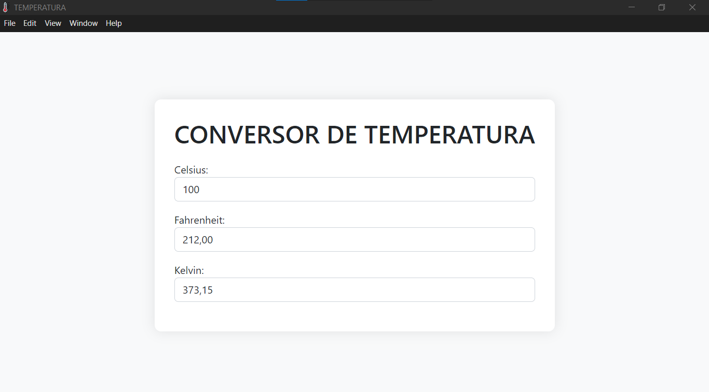

# APP CONVERSOR DE TEMPERATURA
👨‍🏫CONVERSOR DE TEMPERATURA EM CELSIUS, FAHRENHEIT E KELVIN COM ELECTRONJS E BOOTSTRAP.

 <br>

## DESCRIÇÃO:
Esse aplicativo é uma ferramenta simples e intuitiva que permite converter temperaturas entre três unidades: Celsius, Fahrenheit e Kelvin. Ele é projetado para ser fácil de usar e fornece conversões precisas em tempo real.

## FUNCIONALIDADES:
1. **Conversão em Tempo Real**: À medida que o usuário digita uma temperatura em qualquer um dos campos (Celsius, Fahrenheit ou Kelvin), os outros dois campos são atualizados automaticamente para mostrar as conversões correspondentes.
2. **Interface Amigável**: Utiliza o framework Bootstrap para uma interface limpa e responsiva, facilitando o uso em diferentes dispositivos e tamanhos de tela.
3. **Três Unidades de Temperatura**:
   - **Celsius**: Comumente usado em ciência e na maioria dos países ao redor do mundo.
   - **Fahrenheit**: Usado principalmente nos Estados Unidos.
   - **Kelvin**: Usado em ciência e engenharia, especialmente em física.

## EXECUTANDO O PROJETO:
1. **Instalar as dependências do projeto**:
   - No diretório `CODIGO`, abra o terminal ou prompt de comando e execute o seguinte comando:
     ```cmd
     npm install
     ```
   Este comando instala todas as dependências listadas no arquivo `package.json` do seu projeto.

2. **Executar o Aplicativo:**
   - Ainda no diretório `CODIGO`, abra o terminal ou prompt de comando e execute o seguinte comando:
     ```bash
     npm start
     ```
   Este comando inicia a aplicação, abrindo uma janela com o aplicativo pronto para uso.

3. **Usando App:**
   1. **Inserir a Temperatura**: 
      - Digite a temperatura que deseja converter no campo correspondente (Celsius, Fahrenheit ou Kelvin).
   2. **Ver a Conversão**:
      - Os outros dois campos serão atualizados automaticamente para mostrar a temperatura convertida nas outras unidades.

## GERANDO O APLICATIVO:
1. **Configurar o electron-builder**:
   - Verifique se o `electron-builder` está configurado corretamente no `package.json` do projeto, na seção `"build"`. 

2. **Gerar o aplicativo**:
   - No diretório `CODIGO`, abra o terminal ou prompt de comando e digite o seguinte comando:
     ```bash
     npm run build
     ```
   Este comando utiliza o `electron-builder` para gerar o executável e o instalador.

3. **Localizar os arquivos gerados**:
   - Após a conclusão do processo de build, os arquivos gerados estarão localizados na pasta `dist/` dentro do diretório `CODIGO/`. Você encontrará o executável e o instalador do aplicativo.

## NÃO SABE?
- Entendemos que para manipular arquivos em `HTML`, `CSS` e outras linguagens relacionadas, é necessário possuir conhecimento nessas áreas. Para auxiliar nesse aprendizado, oferecemos cursos gratuitos disponíveis:
* [CURSO DE HTML E CSS](https://github.com/VILHALVA/CURSO-DE-HTML-E-CSS)
* [CURSO DE JAVASCRIPT](https://github.com/VILHALVA/CURSO-DE-JAVASCRIPT)
* [CURSO DE NODEJS](https://github.com/VILHALVA/CURSO-DE-NODEJS)
* [CURSO DE BOOTSTRAP](https://github.com/VILHALVA/CURSO-DE-BOOTSTRAP)
* [CURSO DE ELECTRONJS](https://github.com/VILHALVA/CURSO-DE-ELECTRONJS)
* [CONFIRA MAIS CURSOS](https://github.com/VILHALVA?tab=repositories&q=+topic:CURSO)

## CREDITOS:
- [PROJETO CRIADO PELO VILHALVA](https://github.com/VILHALVA)


